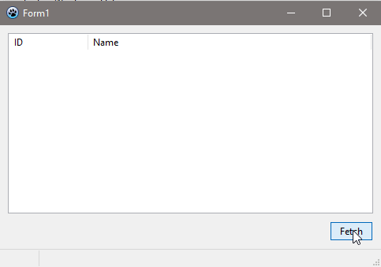

### A test project to study the speed of fetching data from a database and populating a tree with this data

The query first fetches 1000 root records from the server, then fetches the rest of the root and child records from an additional stream.

